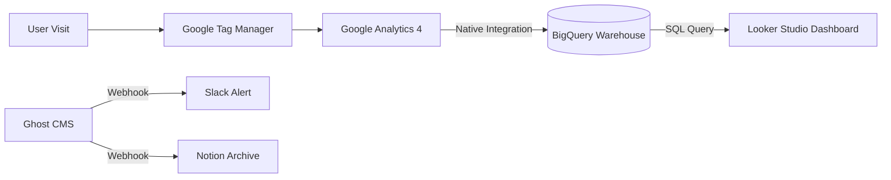

# 📊 Minji Blog Data Pipeline (Senior Analyst Edition)

> "블로그 트래픽을 단순히 '보는' 것이 아니라, '뜯어보고 예측하는' 엔지니어링 파이프라인 구축."

## 1. 아키텍처 개요 (0 to 1 Architecture)
시니어 데이터 분석가라면 단순히 GA4 대시보드만 보지 않습니다. 날것의 데이터(Raw Data)를 소유하고 SQL로 질의할 수 있는 환경을 만듭니다.

---

## 2. 데이터 분석 파이프라인 (The Core)

### Step 1: 데이터 수집 (Collection) - GTM
단순히 GA4 스크립트를 심는 게 아니라, **Google Tag Manager(GTM)**를 중간에 둡니다.
*   **Why?**: "특정 버튼 클릭", "스크롤 50% 도달", "뉴스레터 구독 성공" 같은 미세한 이벤트를 개발자(코드 수정) 없이 마케터/분석가가 직접 통제하기 위함입니다.
*   **Action**:
    1.  GTM 계정 생성 및 컨테이너 코드 발급.
    2.  Ghost `Code Injection`에 GTM 코드 삽입.
    3.  GTM 내부에서 GA4 태그 연결.

### Step 2: 데이터 적재 (Warehousing) - BigQuery
GA4의 데이터 보관 기간은 짧습니다. 평생 데이터를 보관하고 SQL로 분석하기 위해 **BigQuery**로 원본 로그를 쏘아 보냅니다.
*   **Why?**: "작년 이맘때 방문한 사람이 올해 또 왔을까?" 같은 코호트 분석이나 복잡한 SQL 쿼리는 GA4에서 불가능합니다.
*   **Cost**: 구글 클라우드(GCP) 프리 티어 내에서 거의 무료입니다.
*   **Action**:
    1.  GCP 프로젝트 생성.
    2.  GA4 설정 -> `BigQuery Links` -> 연결(Link) 클릭. (하루 한 번 자동으로 데이터가 쌓임)

### Step 3: 데이터 시각화 (BI) - Looker Studio
BigQuery에 쌓인 데이터를 예쁜 그래프로 만듭니다.
*   **Dashboard 구성**:
    *   **Content Performance**: 글 길이(단어 수) 대비 체류 시간 상관관계 분석.
    *   **User Journey**: 메인 -> 글 A -> 글 B -> 구독으로 이어지는 깔때기(Funnel) 분석.

---

## 3. 업무 생산성 파이프라인 (Productivity Automation)
반복 업무를 제거하여 '분석'과 '창작'에만 집중합니다. (추천 툴: **Make.com** 또는 **Zapier**)

### Scenario A: 글 발행 시 자동 홍보
*   **Trigger**: Ghost에 새 글이 발행됨 (RSS Feed 감지).
*   **Action 1**: **Slack** 'my-blog-feeds' 채널에 알림 ("주인님, 새 글이 배포되었습니다!").
*   **Action 2**: **LinkedIn/Twitter**에 제목과 링크 자동 포스팅.

### Scenario B: 아이디어 수집 자동화
*   **Trigger**: 크롬 브라우저에서 버튼 클릭 (Web Clipper).
*   **Action**: **Notion** 'Ideas' 데이터베이스에 링크, 제목, 요약본 자동 저장.

---

## 🛠 지금 당장 시작해야 할 Setup List
1.  **Google Tag Manager (GTM)** 설치 (최우선)
2.  **Google Analytics 4 (GA4)** 속성 생성 및 GTM 연결
3.  **Google Cloud Platform** 프로젝트 생성 (BigQuery용)
